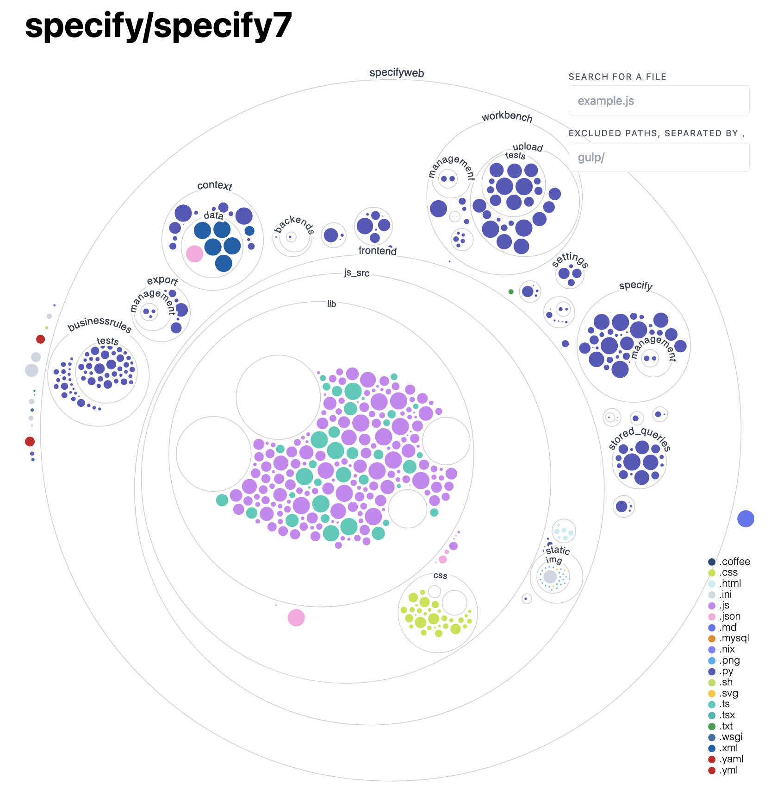
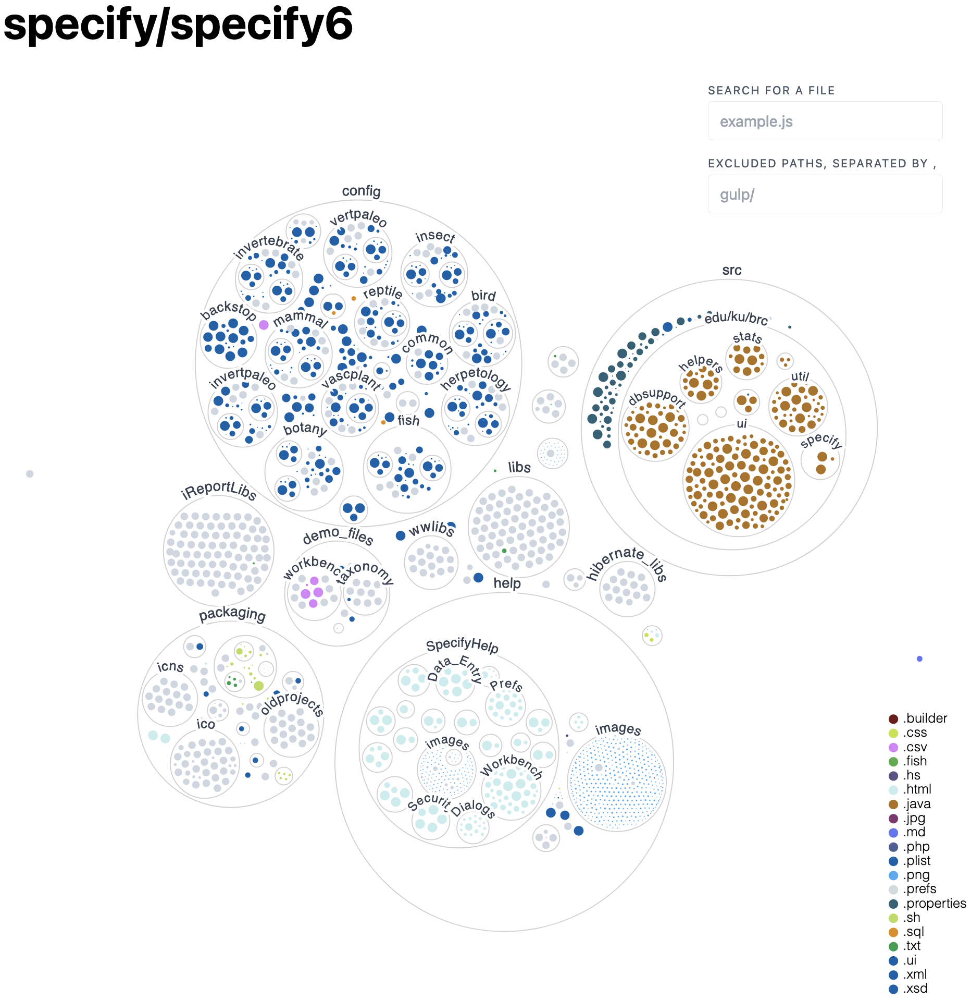

# Code Visualization

Code Visualization is a low-cost and low-effort way to improve project's
documentation. Besides being useful for onboarding new programmers, it also
serves a purpose of an eye-candy.

## GitHub Repository Visualizer

> Languages: any

[Try it out](https://next.github.com/projects/repo-visualization#explore-for-yourself)

Examples:

## SourceTrail

> Languages: C, C++, Java, Python

Visualizes the relationships between files, classes, interfaces and packages

[Download Links](https://github.com/CoatiSoftware/Sourcetrail/releases)

## Class Visualizer

> Languages: Java, Kotlin

[Download Links](https://www.class-visualizer.net/download.html)